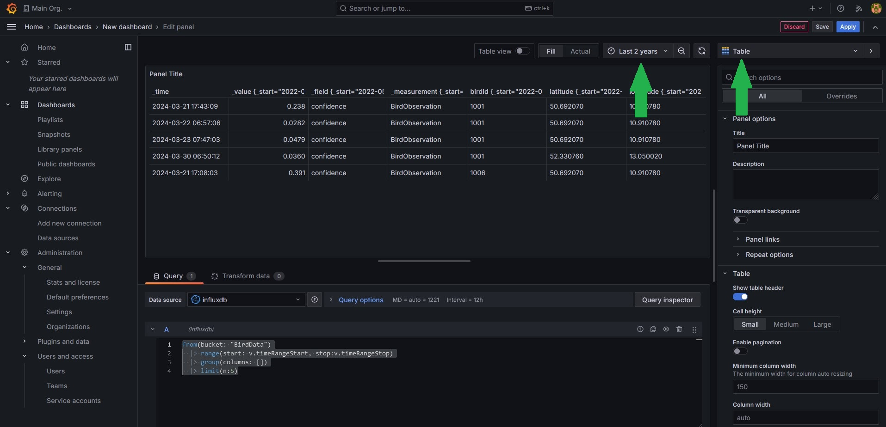

# Dashboard Tutorials

## Basics

In this lesson you will

* Create a Grafana dashboard
* Add visualizations based on the collected data
* Filter the Data to represent secific informations

We have already set up a basic Grafana Instance on the same server the database storing the data lies on. This includes adding the database holding all the collected data as a data souce so that you can directly start creating a dashboard.


## Lesson steps

### Log into the Grafana instance 


### Creating a dashboard
1. Connect to the Grafana server using the following link [http://141.24.194.106:20203](http://141.24.194.106:20203)
2. Log in using the credentials we gave you
3. Click `Dashboards` on the left
4. Click `New` on the right and then `New dashboard`


### Adding visualization
1. Click `Add visualization`
2. Select `influxdb` as the data source
3. First we want to see just the raw data, so set the visualization type in the upper right corner to `Table`, set the time frame to `Last 2 years` and enter the following query

   ```flux
   from(bucket: "BirdData")
    |> range(start: v.timeRangeStart, stop:v.timeRangeStop)
    |> group(columns: [])
    |> limit(n:5)
   ```

