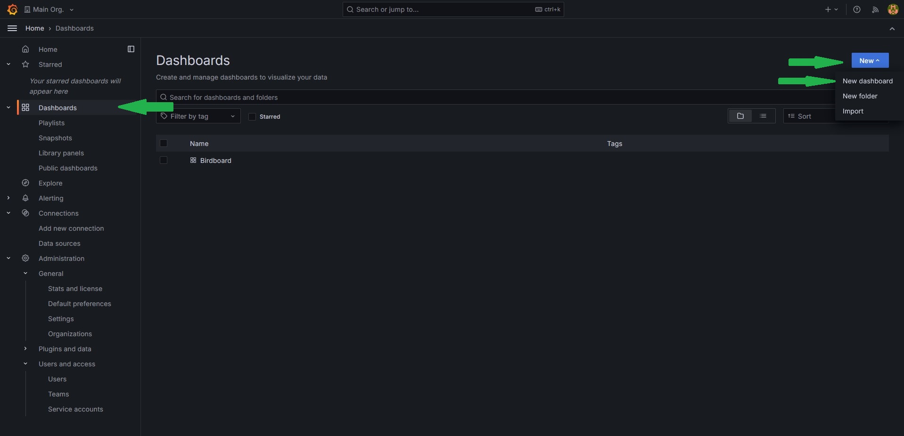

# Dashboard Tutorials

## Basics

In this lesson you will

* Create a Grafana dashboard
* Add visualizations based on the collected data
* Filter the Data to represent secific informations

We have already set up a basic Grafana Instance on the same server the database storing the data lies on. This includes adding the database holding all the collected data as a data souce so that you can directly start creating a dashboard.


## Lesson steps

### Log into the Grafana instance 


### Creating a dashboard
1. Connect to the Grafana server using the following link [http://141.24.194.106:20203](http://141.24.194.106:20203)
2. Log in using the credentials we gave you
3. Click `Dashboards` on the left
4. Click `New` on the right and then `New dashboard`


### Adding visualization
1. Click `Add visualization`
2. Select `influxdb` as the data source
3. First we want to see just the raw data, so set the visualization type in the upper right corner to `Table`, set the time frame to `Last 2 years` and enter the following query
   ```flux
   from(bucket: "BirdData")
    |> range(start: v.timeRangeStart, stop:v.timeRangeStop)
    |> group(columns: [])
    |> limit(n:5)
   ```
4. When your done click save, give your dashboard a name and click save again


### Adding filters
As you can see, the data contains the confidence value. Since the AI model doesn't have an output for `no bird detected` it will always classify some bird for every measurement. If there is indeed no bird in the sample it will usually show by a very low confidence. So it would be good to filter out entries with a confidence below a certain threshold.
1. Go to the Dasboard settings(the gear at top right) and select the tab `Variables`
2. Click `Add variable`
3. Create a variable with the type `Custom`, give it a name(how you refere to the value in your querry, for example `minConf`), a lable(Name that will be displayed in the dashboard) and enter some boundaries in custom options(for example `0.9, 0.75, 0.5, 0.25, 0`).
4. Click `Apply` and `Close` at the top right
5. Click `Add` at the top right and select `Visualization`
6. Select as visualization type again a `table` and copy the code from earlier
7. Add a filter command between the range and the group command. The full querry should look something like this
   ```flux
   from(bucket: "BirdData")
     |> range(start: v.timeRangeStart, stop:v.timeRangeStop)
     |> filter(fn: (r) => r._value > ${minConf},)
     |> group(columns: [])
     |> limit(n:5)
   ```
8. Click `Apply` in the top right and compare how the two tables look, especialy for `minConf=0` and `minConf=0.9`.
9. You can edit a visualization by hovering over it with the cursor and clicking at the three dots appearing in the upper rigth corner and then clicking `edit`. Do that for both tables and change their names()On the right side under `Panel options` the field `titel` so that they are distinguishable. Dont forget to save the dashboard once your done.

### Adding a proper visualization
While the raw data might be useful, what we want from a dashboard is seeing important values with ease. So lets add a counter how many birds were recognised with the given confidence 
1. Add another visualization, this time of the type `Stat`
2. You can reuse the query from the filtered table
3. Instead of limiting the number entries we want to count them. Replace the `limit` command with the count command. It sould look like this
    ```flux
   from(bucket: "BirdData")
     |> range(start: v.timeRangeStart, stop:v.timeRangeStop)
     |> filter(fn: (r) => r._value > ${minConf},)
     |> group(columns: [])
     |> count()
   ```
4. Name the visualization, apply and save.

Another interesting stat would be what birds were recognized the most. Lets add a visualization for that. 
1. Add another visualization. The are some type you can choose from, but this tutorial will use the `Bar gauge` (Hint: Select `Table` as the type to understand how the query looks after every step)
2. For the query, we can use the first three lines from the filterd since that essentially just return all measurements that have the required confidence
3. Next, we want to group all measurements that were of the same bird. We can do this by `|> group(columns: ["birdId"])`. This creates groups of measurements with the same `BirdID`. You can imagine a group as a simple table
4. Since we want to know how often each bird was detected we add `count()`. This counts the measurements in every group and replaces the group content with that value.
5. For the `Bar gauge` we need the data in a single group, but for now every bird has its own group. We fix this by adding `group()`
6. Finally we want the birds in order, therefor we need to sort the current group. We can do this by adding `sort(desc: true)`. This sorts our group entries in descending order, meaning the bird that was spotted the most often should be listed first.
   ```flux
   from(bucket: "BirdData")
     |> range(start: v.timeRangeStart, stop:v.timeRangeStop)
     |> filter(fn: (r) => r._value > ${minConf},)
     |> group(columns: ["birdId"])
     |> count()
     |> group()
     |> sort(desc: true)
   ```
7. On the right side under `Value options` change `Calculate` to `All values`
8. You can customise the visualization if you want. For example changing the orientation to horizontal makes it easier to understand. Dont forget to save once your done.
9. As you might have noticed, instead of bird names the bars are labled with the IDs. This is due to way the data is stored in the database. For now its fine, but if you're insterested you can check [here](https://github.com/Science-Camp-TUI/birdnet-mini/blob/main/idToLables.csv) which ID belongs to which bird.
