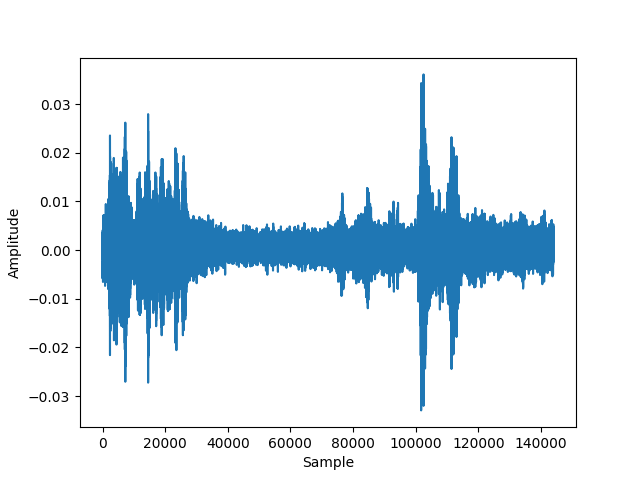

# Audio Processing

## Introduction

The goal of this lesson is to

* load an audio file 
* divide the file into pieces of a specific length (chunks)
* plot the signal of a chunk
* save the signal to a file and listen to it 

In order for you to get a feeling of how audio data is represented in a computer read the following section.


### Digital representation of audio data[^1]

The way of a sound wave to a digital representation is as follows:

1. **Sound Capture**: Sound waves from voices, instruments, or any audio source hit the microphone.

2. **Electrical Conversion:**: Inside the microphone, there's a device that converts these sound waves into electrical signals. These signals are still analog, which means they vary continuously like the original sound waves. The microphone sends these analog signals to an ADC (Analog-Digital-Convert). 

3. **Sampling**: The ADC takes snapshots of the analog signal at regular intervals. This is called 'sampling'. Each snapshot measures the amplitude (volume) of the audio signal at that specific moment. The rate at which this happens is called `sampling rate`. A typical sampling rate is 44100 Hz which means the ADC takes 44100 measurements per second. 

4. **Quantization**: Each sampled amplitude value is then converted into a digital number. The range of numbers that can be used is determined by the 'bit depth'. Higher bit depth means the audio can be more accurately represented. A typical bit depth ist 16 bit. That means that 2^16=65536 different values can be stored for each sample. 

5. **Binary Representation**: The numbers are converted into binary code, which is a series of 0s and 1s, because that's the language computers understand. A wave file contains all the samples at their specific bit depth. 

6. **Compression and Encoding (Optional)**: Sometimes the raw audio data is compressed to save space. Famous compression methods are MP3 (MPEG-1 Layer 3) or AAC (Advanced Audio Coding).

7. **Storage**: Finally, these binary numbers are stored in a file on the computer. If it's a WAV file, it also includes a header with information about the audio like its sample rate, bit depth, and channels (mono or stereo).


You'll find a more detailed introduction [here](https://woodandfirestudio.com/en/sample-rate-bit-depth/){:target="_blank"}[^2]

[^1]: The section was partly produced by GPT-4 Turbo and manually modified afterwards. 

[^2]: Link leads to external resources. Neither TU Ilmenau no any other party involved in this tutorial are responsible for the content linked. 

## Lesson Steps

### Part 1 - Loading and saving audio

The file [test_1min.wav](./files/test_1min.wav){:target="_blank"} contains a one minute recording of bird sounds. 

1. Download the file [test_1min.wav](./files/test_1min.wav){:target="_blank"} and store it in your project folder under a new folder you name `testdata`. 

2. Create a file `audio.py` int the `birdnet-mini` folder. This will contain all your audio processing functions. Your directory shall now look like this:

    ```
    └───birdnet-mini
        ├───birdnet_mini
        │       main.py
        |       audio.py
        │
        └───testdata
                test_1min.wav
    ```


3. In `audio.py` create a new function called `open_audio_file` with the following signature: 

    ```python
     def open_audio_file(path: str, sample_rate=48000, offset=0.0, duration=None): 
    ```
        
    Use the [load function](https://librosa.org/doc/latest/generated/librosa.load.html#librosa.load){:target="_blank"} from the Python package librosa to load the file inside the function as **mono audio** and return the sample samples and the sample rate. 

4. Write another function `save_signal` that takes a filename, a signal (samples) as arguments and uses the [write function](https://python-soundfile.readthedocs.io/en/0.11.0/#read-write-functions){:target="_blank"} from the soundfile package to write an audio signal to a wav file.

5. Now go back to `main.py` import your two functions and test them by loading the test file `test_1min.wav` and save it again under a different name. Listen to the saved file! 

6. Have a look on how the signal is stored as a numpy array. 


### Part 2 - Splitting audio

In order to process the audio by the machine learning model, we need to split it into chunks of a specific length.

1. In the file `audio.py` Write a function `split_signal` that takes a signal and a chunk length as arguments and returns a list of chunks. The function signature may look like this:

    ```python
    def split_signal(signal: np.ndarray, rate:int, seconds:float, overlap: float, min_len:float) -> List[np.ndarray]:
    ```

    remember that your signal is stored as samples. Use [numpy indexing](https://numpy.org/doc/stable/user/basics.indexing.html){:target="_blank"} to split the signal into chunks of a specific length given in seconds. The overlap is sometimes used to make the result more robust. You may omit it if too complicated.

2. (Optional) The signal may not always have a length to get an integer number of chunks. Test if the chunks is too short and if so, add random noise to the end of the signal to make it meet the requested length. You may use the numpy random function to create gaussian noise.  


3. Return the chunks in a default python list.

4. Test your function in `main.py` by loading the test file and splitting it into chunks of 3 seconds. 

5. Now plot the signal of one of the chunks using the [matplotlib](https://matplotlib.org/stable/contents.html){:target="_blank"} package. The result for chunk 0 should look like this:

    

6. Notice, that the signals amplitude is oscillating between -1 and 1 which is a typical data representation for audio signals. Also notice, that the amplitude it rather small.
