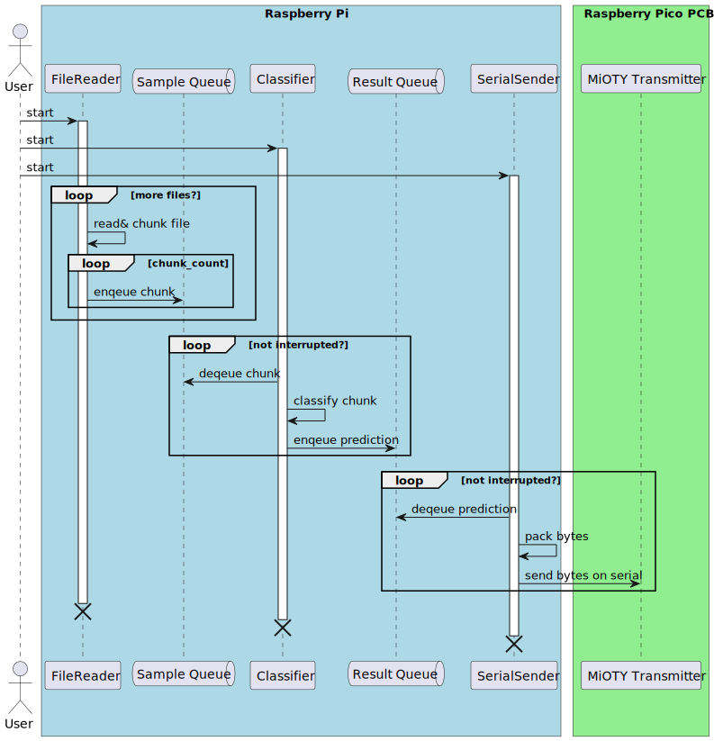
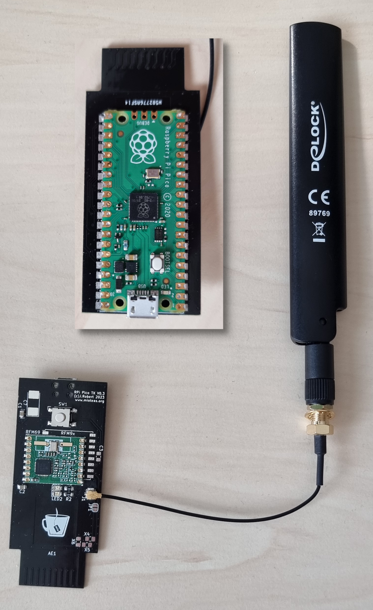

# IoT System Tutorials

Now that you know how to process audio and classify it, you will learn how to 

* continuously process incoming audio data

* classify the data and accumulate the results

* transmit the classification data via a long range transmission network. 

In the scenario, we are simulating, the process of classifying bird songs is continuous. Imaging to use a microphone and enough energy resources, the system could be put into the woods for days for recording and continuously transmitting its results.

In this tutorial we simulate the microphone by a file reader.

The following sequence diagram shows the systems data flow and the components that are involved. 




## Lessons Steps

As you can see from the diagram, the main components run in parallel and transmit their data via so called queues. In order to make them run in parallel we use Python Threads [^1]. 

We will use a class for each component. The class will contain all the necessary methods and attributes to run the component. The common structure will be as follows. 

```python
from threading import Thread

class ComponentClass(Thread):

    def __init__(...):
        raise NotImplementedError

    def interrupt(self):
        raise NotImplementedError

    def run(self):
        raise NotImplementedError
```

The main things to considers during this lessons are:

* which information / data / object does each component need (we shall add them in the `__init__` method)

* what do we need to do in the run method (which, for the most components will loop endlessly)

* how can we interrupt the main loops of each component.  **This is important because it gives the user the possibility to stop the program before finishing.**

Before starting, download the file [SMM11597_20240330_151602.wav](./files/SMM11597_20240330_151602.wav){:target="_blank"} and copy it into a new folder `real_data` in your project folder. We will use the folder in all steps of this tutorial.

### Part 1: The File Reader

1. Create a file `file_reader.py` in the `birdnet_mini` folder. In this file, implement the `FileReader` class using the template from above.

2. The `FileReader` class constructor shall receive 

    * a file path to one ore more audio files, 
    * a path to a meta data file created by the microphone containing the time stamps of the audio files and the latitude/longitude coordinates of the microphone during recording. 
    * the queue to send the sample chunks (and metadata) to, 
    * the sample rate it shall create the chunks with (we will fix duration (3s), overlap (0s) and min length (1) in this tutorial). 
    
    Store these values in member variables (e.g. `self._sample_rate`).

3. Still in the `__init__`  method, parse the folder for all audio files (wav, or mp3 etc.) and store the file paths in a list in a member variable.

4. Download the file [metadata.py](./files/metadata.py){:target="_blank"}  in the `birdnet_mini` folder and use the `MetaData` class from this file to store it in the member variable `self._metadata`. **(Optional)** Instead of downloading the implementation of the `MetaData` class, you can also implement it yourself. For format reference check the file  [SMM11597_Summary.txt](./files/SMM11597_Summary.txt){:target="_blank"}  from the `real_data`.

5. Implement the `run` method. In this method, you iterate the the audio file names one by one in a loop extract the metadata per file and create chunks of audio data. 

    a. Before opening the audio file, extract the basename of the file  (e.g. `SMM11597_20240330_151602`)[^2] and use it to get the `timestamp`, `latitude (lat)` and `longitude` using the `MetaData.get_timestamp_lat_lon` method.

    b. Use the methods `open_audio_file` and `split_signal` from your `audio.py` file to get the chunks from the audio file. 

6. For each chunk put a tuple to the sample queue that contains `(chunk, timestamp, latitude, longitude)` in a second (nested) loop. In each iteration of the outer loop, check if the component has been interrupted. If so, break the loop.

### Part 2: The Classifier

1. Create a file `classifier.py` in the `birdnet_mini` folder. In this file, implement the `BirdClassifier` class using the template from above.


2. The `BirdClassifier` class constructor shall receive 

    * an instance of the Model class you implemented in the previous lesson, 
    * the queue to receive the sample chunks and metadata from
    * the queue to send the classification results to (result queue)

    Store these values in member variables (e.g. `self._model`).

3. Implement the `run` method. In this method, create an loop that runs until `self._interrupted` is `True`. In this loop

    * retrieve the next tuple of  `(chunk, timestamp, latitude, longitude)`. Use the `Queue.get` method with a short timeout of `0.1` to retrieve the tuple [^3].
    * classify the chunk using the `Model.predict` method.
    * Store the result in a dictionary:
        ```python
        data = {
            "class_id": class_id,
            "confidence": confidence,
            "lat": random_lat,
            "lon": random_lon,
            "timestamp": datetime.datetime.now().timestamp()
        }
        ```   
4. Put the data into the result queue.


### Part 3: The Transmitter (Serial Sender)

1. Create a file `transmission.py` in the `birdnet_mini` folder. In this file, implement the `SerialSender` class using the template from above.

2. The `SerialSender` class constructor shall receive 

    * the queue to read the classification results from (result queue)
    * the serial port to be used  (e.g. `/dev/ttyUSB0` or `COM1`) to send the data to
    * the serial baud rate to be used (e.g. `115200`). Set it to `115200` as default.
    * an interval in seconds to when data shall be sent. This is important, since the the receiving Raspberry Pico can only handle a certain amount of data per second. Set it to `2` as default.

3. Implement the `run` method. In this method, create an loop that runs until `self._interrupted` is `True`. In this loop

    * retrieve the next classification result. Use the `Queue.get` method with a short timeout of `0.1` to retrieve the tuple [^3].
    * Since we cannot send the whole dictionary (e.g. as Json) we need to pack the data as efficiently as possible. There only store the values of the dictionary in a list with the following order:
        ````python
        data_simple = [data_dict['class_id'], data_dict['confidence'],
                           data_dict['lat'], data_dict['lon'], data_dict['timestamp'].timestamp()]
        
    * Now use the [Python struct package](https://docs.python.org/3/library/struct.html){:target="_blank"} to pack the data into a binary data. Use the format string `'Hfffd'` for the packing. 

    * Send the packed data over the serial port. We use the [Python serial package](https://pyserial.readthedocs.io/en/latest/shortintro.html){:target="_blank"} to send the data.

    * wait for the time interval before sending the next data.

    * when the loop is interrupted, close the serial port.


### Part 4: Bringing it all together

Now you have all the components ready. You can now modify you main file `main.py` in the `birdnet_mini` folder. 

1. Import the classes `FileReader`, `BirdClassifier` and `SerialSender` from the respective files.

2. Create instances of the classes and start them as threads.

3. Create an endless loop waiting a short amount of time in each loop, that is surrounded by a code part catching user interrupts (e.g. pressing `Ctrl+C`):

    ```python
    try:
        while True:
            time.sleep(0.2)
    except KeyboardInterrupt:
        ...
    ```
4. when interrupted, stop the threads by calling the `interrupt` method of each component and join the threads using the `Thread.join` method.


### Part 5: The Transmitter PCB (optional)

We use a Rapsberry Pico microcontroller connected via USB serial port. The Hardware is a custom layout create by the TU Ilmenau. I holds the Pico as well as the sending module. 

{width="40%"}

The code for the microcontroller is written in C++ and pretty simple. However, adding it to this tutorial would be too much. The whole repository can be found [here](https://github.com/Science-Camp-TUI/TS-UNB-Lib-Pico) on the `science-camp` branch.


### Part 6: Testing

Connect the Raspberry Pico to your computer and start the Python program. You should see the data being sent to the Pico.


### Part 7: Transfer to the Raspberry Pi

Once tested successfully, the code needs to be transferred to the Raspberry Pi. You may zip it and copy it over. The instructor will guide you through the process of running the code on the Raspberry Pi.


[^1]: [Python Threads](https://docs.python.org/3/library/threading.html){:target="_blank"} are used to run multiple tasks concurrently. Threads are lighter than processes and share the same memory space. They are perfect for IO-bound tasks, such as reading from a file or sending data over a network. Pleas notice that Python threads are not real system threads such as in programming languages like C++.

[^2]: You may use the [Python pathlib module stem function](https://docs.python.org/3/library/pathlib.html){:target="_blank"} to extract the basename of the file. 

[^3]: Make sure you handle the `queue.Empty` exception that is raised when the queue is empty and the timeout is over.